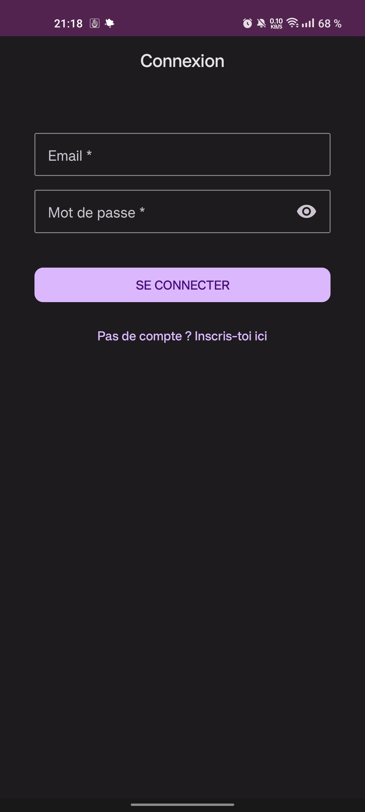
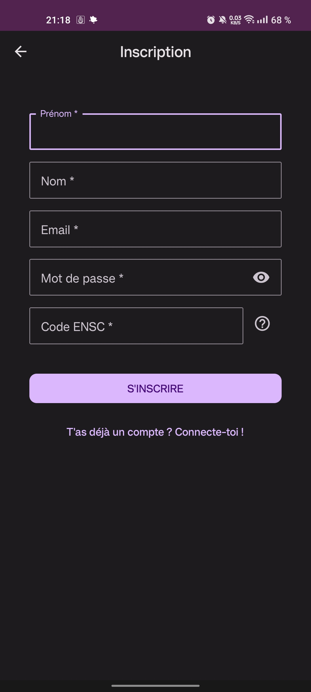
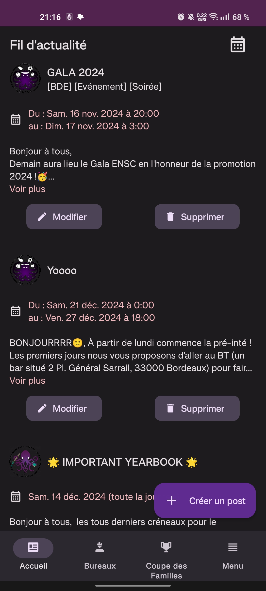
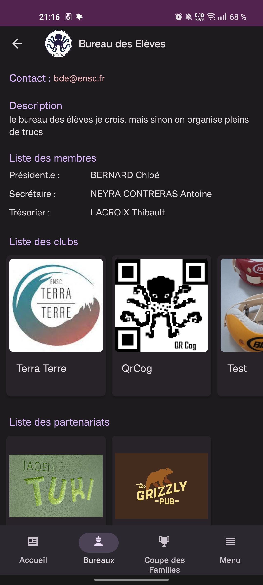
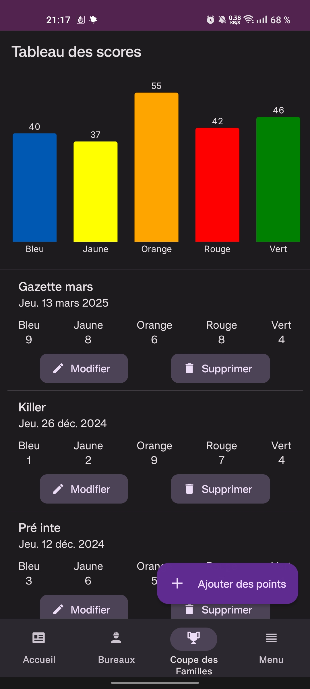
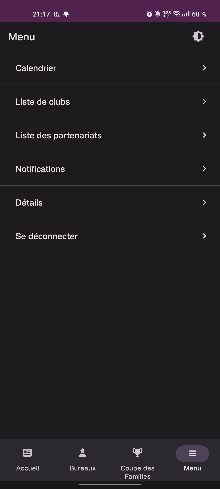

# Poulp'App

La **Poulp'App** est une application mobile destinée aux étudiants de l'**ENSC** (École Nationale Supérieure de Cognitique). Elle centralise sur une seule plateforme l'ensemble des informations liées **à la vie associative de l'école**.

**Login flow**
 

 

**Main screens**
 

## Table of Contents

- [Poulp'App](#poulpapp)
  - [Table of Contents](#table-of-contents)
  - [1. Fonctionnalités](#1-fonctionnalités)
    - [1.1. Les posts](#11-les-posts)
      - [1.1.1. Le fil d'actualité](#111-le-fil-dactualité)
      - [1.1.2. Calendrier](#112-calendrier)
    - [1.2. Les associations](#12-les-associations)
      - [1.2.1. Les bureaux](#121-les-bureaux)
      - [1.2.2. Les clubs](#122-les-clubs)
      - [1.2.3. Les partenariats](#123-les-partenariats)
      - [1.2.4. Les membres](#124-les-membres)
    - [1.3. La Coupe des Familles](#13-la-coupe-des-familles)
      - [1.3.1. Graphique](#131-graphique)
      - [1.3.2. Points](#132-points)
  - [2. Technologies](#2-technologies)
    - [Packages principaux](#packages-principaux)
  - [3. Architecture](#3-architecture)
    - [3.1. Firebase](#31-firebase)
      - [3.1.1. Authentication](#311-authentication)
      - [3.1.2 Firestore](#312-firestore)
    - [3.2 Navigation](#32-navigation)
  - [Futur](#futur)

## 1. Fonctionnalités

L'application permet aux étudiants de consulter des **posts** annonçant divers événements. Elle regroupe également toutes les informations concernant les **associations**, les **clubs** et les **partenariats**. Un graphique intégré permet de suivre l'évolution de la **Coupe des Familles**.

### 1.1. Les posts

La fonctionnalité principale est la publication de posts par les associations majeures de l'école (BDE, BDS, BDA et JE).

Un post est composé :

- d'un titre _(obligtoire)_,
- d'une description,
- d'une image,
- d'une date,
- de tags,
- et d'un éditeur _(obligatoire)_ (BDE, BDS, etc)

#### 1.1.1. Le fil d'actualité

Le fil d'actualité est une liste de tous les posts publiés, dans l'ordre de création décroissant (le plus récent en premier).

L'image est la partie la plus importante du post, la description étant tronquée à 3 lignes. Il est possible de l'agrandir en cliquant dessus.

Le logo de l'éditeur du post est cliquable et renvoie vers la page de l'éditeur.

La date est aussi cliquable et renvoie vers le calendrier à la date du post.

En tant qu'administrateur ou éditeur il est possible de créer un post en cliquant sur le "plus" en bas à droite de l'écran. Il est aussi possible de modifier/supprimer les posts que l'on a édité (les administrateurs ont accès à tous les posts).

#### 1.1.2. Calendrier

Il est possible d'accéder au calendrier via un bouton en haut à droite du fil d'actualité, via le menu et via la date d'un post.Les deux premières manières mènenent à la date du jour dans le calendrier, la troisème mène à la date du post.

Le calendrier contient tous les posts ayant une date sous forme de planning vertical. L'aperçu des posts est composé du titre, des 2 premières lignes de la description, accompagnés par l'heure de début et la durée (informations remplacées par la mention _journée entière_)

### 1.2. Les associations

#### 1.2.1. Les bureaux

_WIP_

#### 1.2.2. Les clubs

_WIP_

#### 1.2.3. Les partenariats

_WIP_

#### 1.2.4. Les membres

_WIP_

### 1.3. La Coupe des Familles

#### 1.3.1. Graphique

_WIP_

#### 1.3.2. Points

_WIP_

## 2. Technologies

Outils principaux :

- React Native
- Firebase (Auth, Firestore, Storage)
- Expo - EAS
- Typescript

### Packages principaux

- @backpackapp-io/react-native-toast : ^0.11.0
- @react-native-async-storage/async-storage : 1.23.1
- @react-native-community/datetimepicker : 8.0.1
- @react-navigation/native : ^6.1.15
- @react-navigation/native-stack : ^6.9.24
- dotenv : ^16.4.7
- effector : ^23.2.0
- effector-react : ^23.2.0
- expo-image-picker: ~15.0.7
- react-hook-form : ^7.51.1
- react-native-calendars : ^1.1307.0
- react-native-paper : ^5.12.3
- styled-components : ^6.1.8
- victory-native : ^41.12.0

## 3. Architecture

### 3.1. Firebase

#### 3.1.1. Authentication

_WIP_

#### 3.1.2 Firestore

_WIP_

### 3.2 Navigation

_WIP_

## Futur

Voici les fonctionnalités et améliorations graphiques prévues :

- Un éditeur de texte (hyperlien, gras, italique, souligné, taille de police, couleur)
- Modifier son profil (étudiants et associations)
- Ajouter et supprimer des étudiants (administrateur)
- Gestion de ses propres posts (associations)
- Importer des vidéos sur les posts
- Galerie intégrée avec les images chargées sur l'application
- Filtre du fil d'actualité (par association, par date, etc.)
- Possibilité d'ajouter un sondage dans le post
- Réactions et commentaires à un post
- Importer un tableur pour sélectionner automatiquement les étudiants qui ont adhéré à une association
- ...
